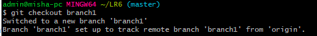
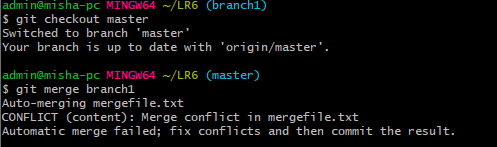

Регистрируюсь на GitHub, после чего скачиваю Git

Ввожу user.name и user.email

Копирую сохранённые данные с профиля

Перехожу в созданную папку Lr6

Запрашиваю изменения с GitHub

Запрашиваю историю ветки

Вывожу историю ветки

Получаю список веток

История ветки Branch1

Информация о изменениях

Перехожу в ветку master и сливаю ее с Branch1

Вывожу статус и смотрю конфликты

Добавляю файл txt после его изменения

Проверяю статус, конфликтов нет

Коммитю изменения

Удаляю ветку branch1

Добавляю файл 1.txt

Коммитю

Добавляю файл 2.txt

Коммитю

Сбрасываю настройки

Создаю ветку Doklad

Список моих коммитов

Заливаю все на свой GitHub

Скриншот создания файла в GitHub

Лог команд

git config --global user.name "4917BeglarovMA "

git config --global user.email fox00900@mail.ru

git clone https://github.com/4917BeglarovMA/LR6

cd LR6

git pull

git log

git branch

git checkout branch1

git log

git log -p

git checkout master

git merge branch1

git status

git add mergefile.txt

git status

git commit -m "Commit changes"

git branch -d branch1

git add 1.txt

git commit -m "text1.txt"

git add 2.txt

git commit -m "text2.txt"

git reset --hard HEAD~1

git checkout -b Doklad

git log

git push --all https://github.com/4917BeglarovMA/LR6

git add Image

git commit -m "Added file Image"

git push --all https://github.com/4917BeglarovMA/LR6
